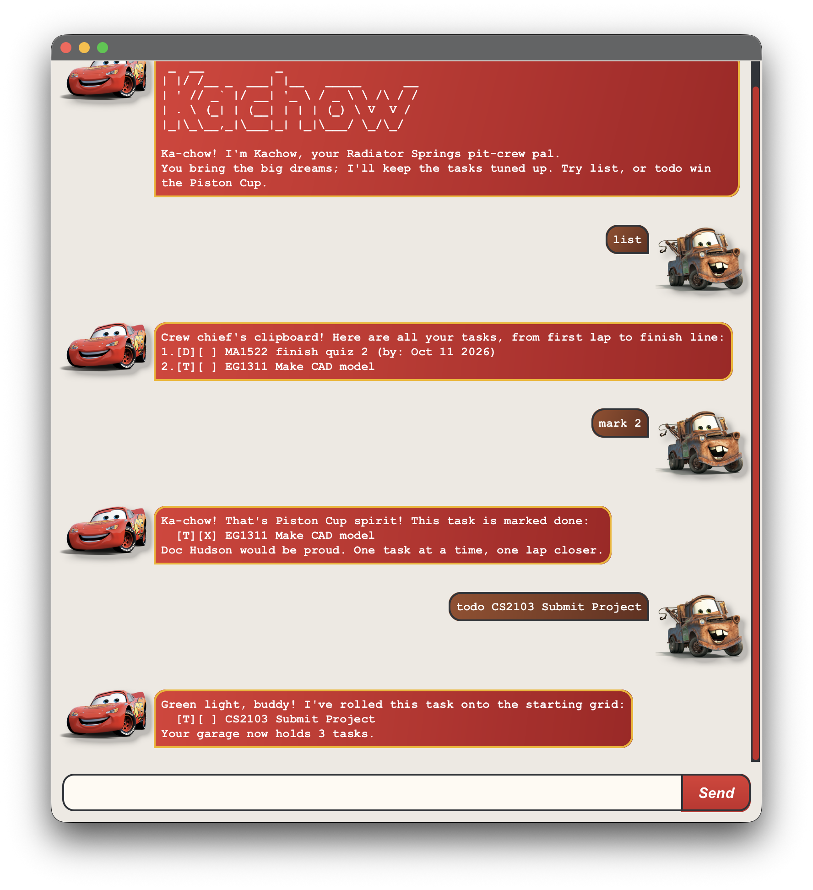

# Kachow User Guide



Kachow is a Cars-inspired task companion for keeping track of everyday work, deadlines, and events.
Type short commands into its chat window to add tasks, find what needs doing, and celebrate completed work
with your Radiator Springs pit crew. Tasks are saved on your computer and loaded the next time you start.

## Contents

- [Quick start](#quick-start)
- [Command format](#command-format)
- [Dates and times](#dates-and-times)
- [Adding deadlines](#adding-deadlines)
- [Adding todos](#adding-todos)
- [Adding events](#adding-events)
- [Listing tasks](#listing-tasks)
- [Finding tasks](#finding-tasks)
- [Viewing tasks on a date](#viewing-tasks-on-a-date)
- [Marking tasks as done](#marking-tasks-as-done)
- [Marking tasks as not done](#marking-tasks-as-not-done)
- [Editing tasks](#editing-tasks)
- [Deleting tasks](#deleting-tasks)
- [Exiting Kachow](#exiting-kachow)
- [Saving and backing up tasks](#saving-and-backing-up-tasks)
- [FAQ and troubleshooting](#faq-and-troubleshooting)
- [Known limitations](#known-limitations)
- [Command summary](#command-summary)

## Quick start

1. Install **Java 25**. Check your installation by running `java -version` in a terminal.
   On macOS, use Zulu JavaFX JDK `25.0.3.fx-zulu`. If you use SDKMAN and this JDK is already installed,
   select it with `sdk use java 25.0.3.fx-zulu`.
2. Obtain `kachow.jar` from the project's [releases page](https://github.com/benwoo1110/ip/releases),
   if a packaged release is available. Alternatively, build it from the project folder with
   `./gradlew shadowJar` on macOS/Linux or `.\gradlew.bat shadowJar` in Windows PowerShell.
   The resulting file is `build/libs/kachow.jar`.
3. Put `kachow.jar` in a folder where you want to keep your tasks. Open a terminal in that folder
   (or use `cd` to navigate there), then run:

   ```sh
   java -jar kachow.jar
   ```

4. The chat window opens with the title **Kachow** and Kachow's greeting. Type a command in the box
   at the bottom and press **Enter** or click **Send**. Replies appear in the conversation above it.
5. Try these commands one at a time:

   ```text
   todo read book
   deadline submit report /by 2026-10-11 1800
   event project meeting /from 2026-10-11 1400 /to 1600
   list
   ```

Starting without an existing data file gives you an empty task list; the screenshot shows example tasks.
If you already have saved tasks, enter `list` to see them.

For a terminal interface, run `java -cp kachow.jar com.benthecat.kachow.Kachow` from the same folder.
Both interfaces support the commands below and use the same data location. Run only one instance at a time.

## Command format

- Command names and field names are **case-sensitive**: use `todo` and `/by`, not `TODO` or `/BY`.
- Words in `UPPER_CASE` are values you replace. For example, `todo DESCRIPTION` becomes `todo read book`.
- Square brackets in a command format indicate optional parts; do not type those brackets.
- An ellipsis (`...`) in a command format means the preceding part can be repeated; do not type the ellipsis.
- Enter one command per submission. Separate command names, field names, and values with spaces.
  Leading/trailing whitespace, tabs, and repeated spaces are normalized, including in descriptions.
- Descriptions must be non-empty. Punctuation and Unicode text are allowed, but `|`, line breaks,
  control characters other than tabs, and separate slash-prefixed fields such as `/oops` are rejected.
- Task numbers start at **1**. Use a number shown by `list`, `find`, or `on`.
  Signs, decimals, extra arguments, and numbers outside the current list are rejected.
- `list` and `bye` take no arguments; extra text causes an error.
- Adding a task places it at the end of the list as incomplete. Counts include completed tasks.
- Duplicate tasks are rejected on both add and edit. A duplicate has the same type, description
  (ignoring case and repeated whitespace), and dates/times, even if its completion status differs.
  A date-only value and an explicit midnight time are treated as different details.

Task displays use `[T]` for todos, `[D]` for deadlines, and `[E]` for events.
`[ ]` means incomplete; `[X]` means complete. For example, `2.[D][X] submit report (by: Oct 11 2026)`
is completed deadline number 2.

The response examples below show message text without the console's surrounding divider lines and
four-space indentation. Each feature example starts from its stated setup independently.

## Dates and times

Use `yyyy-MM-dd` for unambiguous dates. The following date formats are supported:

| Format | Example | Meaning |
| --- | --- | --- |
| `yyyy-MM-dd` | `2026-12-02` | December 2, 2026 |
| `yyyy/M/d` | `2026/12/2` | December 2, 2026 |
| `d/M/yyyy` | `2/12/2026` | December 2, 2026 |
| Padded US `MM/dd/yyyy` | `12/02/2026` | December 2, 2026 |

**Ambiguous padded dates are month-first:** `02/12/2026` means February 12, while `2/12/2026`
means December 2. A padded day-first date whose first number exceeds 12, such as `13/02/2026`,
is also accepted. Prefer the year-first format to avoid this ambiguity.

Append a time after a space when needed:

| Time format | Examples |
| --- | --- |
| 24-hour, four digits | `0900`, `1800` |
| 24-hour with a colon | `09:00`, `18:00` |
| AM/PM, with optional minutes and space | `6pm`, `6 PM`, `6:30pm`, `6:30 PM` |

AM/PM is case-insensitive. Full ISO local date-times such as `2026-12-02T18:00` are also accepted.
Dates display as `Dec 02 2026`; times display as `6:00 PM`.
Invalid dates such as `2026-02-30` and natural-language dates such as `tomorrow` are rejected.

A new deadline and an event's start require a date. A time alone is accepted for an event's end
(using its start date), or when editing an existing date/time field (keeping that field's existing date).
The `on` command accepts only a date, without a time.

## Adding deadlines

Adds a task that must be completed by a date, optionally with a time.

**Format:** `deadline DESCRIPTION /by DATE [TIME]`

Provide exactly one `/by` field after the description. A date alone is valid; a time alone is not.

**Example:** Starting with an empty list, enter `deadline submit report /by 2026-10-11 1800`.

```text
Green light, buddy! I've rolled this task onto the starting grid:
  [D][ ] submit report (by: Oct 11 2026, 6:00 PM)
Your garage now holds 1 task.
```

Another example: `deadline return book /by 2026-10-12` creates a deadline without a time.

## Adding todos

Adds a task that does not need a date or time.

**Format:** `todo DESCRIPTION`

**Example:** Starting with an empty list, enter `todo read book`.

```text
Green light, buddy! I've rolled this task onto the starting grid:
  [T][ ] read book
Your garage now holds 1 task.
```

## Adding events

Adds a task with a start and an end.

**Format:** `event DESCRIPTION /from START /to END`

Use exactly one `/from` followed by exactly one `/to`. The end must be strictly later than the start.
Date-only boundaries are compared at midnight. For a same-day event, supply times to distinguish them.

**Example:** Starting with an empty list, enter
`event project meeting /from 2026-10-11 1400 /to 1600`.

```text
Green light, buddy! I've rolled this task onto the starting grid:
  [E][ ] project meeting (from: Oct 11 2026, 2:00 PM to: Oct 11 2026, 4:00 PM)
Your garage now holds 1 task.
```

For an overnight event, include the end date explicitly:
`event overnight study /from 2026-10-11 2300 /to 2026-10-12 0100`.
Using `/to 0100` alone would keep October 11 and fail because the end would precede the start.

## Listing tasks

Shows all tasks, including completed tasks, in their list order. Tasks are not sorted by due date.

**Format:** `list`

**Example:** After entering the three task-creation commands in Quick start into an empty list, enter `list`.

```text
Crew chief's clipboard! Here are all your tasks, from first lap to finish line:
1.[T][ ] read book
2.[D][ ] submit report (by: Oct 11 2026, 6:00 PM)
3.[E][ ] project meeting (from: Oct 11 2026, 2:00 PM to: Oct 11 2026, 4:00 PM)
```

An empty list produces:

```text
Quiet as Radiator Springs before sunrise! Add a task with todo, deadline, or event.
```

## Finding tasks

Searches task descriptions, ignoring letter case. Partial words match, and multiple words are treated
as one continuous phrase: `find read book` searches for that phrase, not either word separately.
Dates and completion markers are not searched. Completed tasks can appear in the results.

**Format:** `find KEYWORD_OR_PHRASE`

**Example:** With the Quick start tasks, enter `find REPORT`.

```text
Mater found 'em! Here are the tasks that match your search:
2.[D][ ] submit report (by: Oct 11 2026, 6:00 PM)
```

Results keep their **original task numbers**. Here, use `mark 2` to complete the matching task.
Searching does not change the list or the meaning of task numbers.
If `find laundry` has no matches, the response is:

```text
Mater checked every back road: no tasks matched "laundry". Try another keyword, buddy.
```

## Viewing tasks on a date

Shows deadlines due on the specified date and events whose date range includes that date.
Both the start and end dates are included, even when an event ends at midnight.
Todos are excluded; completed deadlines and events are included. Original task numbers are retained.

**Format:** `on DATE`

**Example:** With the Quick start tasks, enter `on 2026-10-11`.

```text
Sally's road map! Here are the deadlines and events on Oct 11 2026:
2.[D][ ] submit report (by: Oct 11 2026, 6:00 PM)
3.[E][ ] project meeting (from: Oct 11 2026, 2:00 PM to: Oct 11 2026, 4:00 PM)
```

If no dated tasks match `on 2026-10-12`, the response is:

```text
Cruise through Radiator Springs! No deadlines or events on Oct 12 2026.
```

## Marking tasks as done

Marks the selected task as complete without removing it or changing its number.

**Format:** `mark TASK_NUMBER`

**Example:** With `read book` as task 1, enter `mark 1`.

```text
Ka-chow! That's Piston Cup spirit! This task is marked done:
  [T][X] read book
Doc Hudson would be proud. One task at a time, one lap closer.
```

Marking an already completed task leaves it completed and shows the same confirmation.

## Marking tasks as not done

Makes a completed task incomplete again, preserving its details and number.

**Format:** `unmark TASK_NUMBER`

**Example:** With completed todo `read book` as task 1, enter `unmark 1`.

```text
Another practice lap! Even Lightning needs those. This task is marked not done:
  [T][ ] read book
```

Unmarking an already incomplete task leaves it incomplete and shows the same confirmation.

## Editing tasks

Replaces one or more details of an existing task. Its type, completion status, and list position remain the same.

**Format:** `edit TASK_NUMBER [/description DESCRIPTION] [/by DATE_OR_TIME] [/from START] [/to END]`

Supply at least one field. Fields can appear in any order, but each may appear only once and must have a value.
Only these fields apply to each task type:

| Task type | Editable fields |
| --- | --- |
| Todo | `/description` |
| Deadline | `/description`, `/by` |
| Event | `/description`, `/from`, `/to` |

Unmentioned fields retain their values. A time-only edit retains that individual field's existing date.
For events, changing `/from` does not automatically move `/to`; use full dates for both when moving an
entire event to another day. A date-only replacement removes the time from that field.

All requested changes are applied together only if the entire edit is valid and can be saved.
An invalid field, duplicate task, or event end at or before its start rejects the whole edit.

**Example:** With the Quick start tasks, enter `edit 2 /by 1900 /description submit final report`.

```text
Pit stop complete! Guido's updated this task's details:
  [D][ ] submit final report (by: Oct 11 2026, 7:00 PM)
```

Other examples with the same starting tasks:

- `edit 1 /description read novel` renames the todo.
- `edit 3 /from 1300 /to 1700 /description planning meeting` changes the event's name and both times.
- `edit 2 /by 2026-10-12` moves the deadline to October 12 and removes its time.

## Deleting tasks

Permanently removes the selected task and shows the remaining count. Tasks after it are renumbered.
Use `list` again before acting on another task if you are unsure of its new number. There is no undo command.

**Format:** `delete TASK_NUMBER`

**Example:** With the three Quick start tasks, enter `delete 1`.

```text
Mater's towing this one off the roster. Task deleted:
  [T][ ] read book
Your garage now holds 2 tasks.
```

The deadline is now task 1 and the event is task 2.

## Exiting Kachow

**Format:** `bye`

Produces the farewell below and exits. In the GUI, the window closes immediately, so the farewell
may not remain visible:

```text
Time to refuel at Flo's. Rest those tires, buddy. Ka-chow!
```

Enter `bye` to exit either interface. In the GUI, press **Enter** or click **Send** to submit it.
You can also exit the GUI using the window's close button.
Successful task changes have already been saved, so no separate save command is needed before closing.

## Saving and backing up tasks

Kachow automatically saves after each successful add, mark, unmark, edit, or delete.
It loads tasks at startup from `./data/kachow.txt`. The path is relative to the folder from which you
launch Kachow, so always launch it from the same folder. It is not necessarily the folder containing the JAR
if you run the JAR using a path from somewhere else.

A missing data file starts an empty list. Kachow creates the directory and file when it first saves a change.
Only task details and completion states are saved; the chat conversation is not restored.

To back up or transfer tasks:

1. Close Kachow.
2. Copy `data/kachow.txt` to a safe backup location.
3. On the destination computer, install Java 25 and place Kachow in your chosen launch folder.
4. Create a `data` folder there and copy the backup into it as `kachow.txt`.
   Back up any existing destination file before replacing it.
5. Start Kachow from that folder and enter `list` to check the restored tasks.

Prefer the `edit` command to changing the data file manually. If a file is unreadable or malformed
(including duplicate records), Kachow reports a startup error, displays an empty in-memory list, and
**disables saving for that session** to protect the file. Close Kachow, repair the indicated record or
restore a backup, and restart. The data path must be a regular file, not a directory or symbolic link.

If saving fails, the command does not change the task list or replace the saved data. Check file and
folder permissions, available disk space, and whether the filesystem supports atomic file replacement.
If another program changes or deletes the file during a session, restart Kachow to load the latest data
before making further changes. Use one Kachow instance at a time.

## FAQ and troubleshooting

**Why are my tasks missing after restarting?**

Check that you launched Kachow from the same folder as before and that its `data/kachow.txt` is present.
If there was a startup loading error, follow the recovery steps above; the empty display does not mean
Kachow erased the original file.

**Why does Kachow reject my command?**

Read the error reply for the required format. Check lowercase command/field names, required descriptions,
spaces around field markers, valid dates, and the current task number. For example, `todo` alone produces:

```text
Pit stop, buddy! Let's get you rolling. This racer needs a name. Use: todo DESCRIPTION
```

Correct the command and submit it again. Rejected commands leave tasks unchanged.

**Why was my new task rejected as a duplicate?**

The same type, description, and dates/times already exist. Use `list` or `find` to locate the task,
then edit it or unmark it if you need to work on it again. Changing capitalization or marking the old
task complete does not make a new copy unique.

**Why does a search result start at 2 or 3?**

`find` and `on` retain numbers from the complete list. Use the number printed beside the result,
not its position among the matches.

**Why will the JAR not start?**

Check `java -version` reports Java 25 and that the terminal is in the folder containing `kachow.jar`.
Use the packaged JAR or the `shadowJar` build output so that dependencies are included.
For JavaFX startup problems on macOS, check that you selected the JavaFX JDK specified in Quick start.

## Known limitations

- There are no reminder notifications, recurring tasks, undo, bulk clear, or task-type conversion commands.
  Dates help you organize and query tasks; they do not trigger alerts.
- There is no `help` command. Refer to this guide or the command summary below.
- Dates and times are local values without time-zone conversion. The `on` command matches calendar dates,
  including both ends of an event's date range.

## Command summary

| Action | Format | Example |
| --- | --- | --- |
| Add a deadline | `deadline DESCRIPTION /by DATE [TIME]` | `deadline submit report /by 2026-10-11 1800` |
| Add a todo | `todo DESCRIPTION` | `todo read book` |
| Add an event | `event DESCRIPTION /from START /to END` | `event meeting /from 2026-10-11 1400 /to 1600` |
| List all tasks | `list` | `list` |
| Search descriptions | `find KEYWORD_OR_PHRASE` | `find report` |
| View a date | `on DATE` | `on 2026-10-11` |
| Mark complete | `mark TASK_NUMBER` | `mark 1` |
| Mark incomplete | `unmark TASK_NUMBER` | `unmark 1` |
| Edit details | `edit TASK_NUMBER FIELD VALUE [FIELD VALUE]...` | `edit 2 /by 1900 /description submit final report` |
| Delete a task | `delete TASK_NUMBER` | `delete 1` |
| Exit Kachow | `bye` | `bye` |

For `edit`, use only the fields supported by the selected task type, as listed in [Editing tasks](#editing-tasks).
